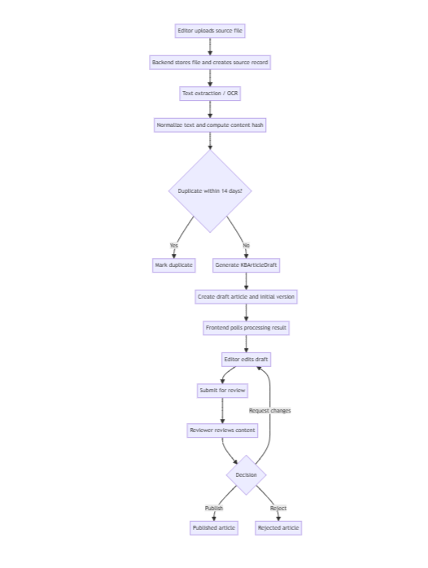
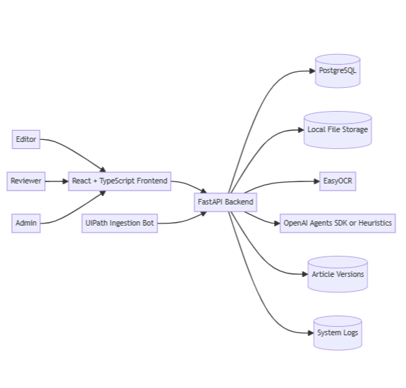

# DHL Knowledge Base Automation

> AI-assisted knowledge capture for DHL logistics operations.  
> Built as a project for the **UTM × DHL Asia Pacific Shared Services Digital Automation Challenge 3.0**.

<p align="center">
  <a href="./docs/system_design.md"><strong>System Design</strong></a> ·
  <a href="./docs/module_breakdown.md"><strong>Module Breakdown</strong></a> ·
  <a href="./docs/uipath_setup_guide.md"><strong>UiPath Setup Guide</strong></a> ·
  <a href="./docs/systemRequirement.md"><strong>System Requirements</strong></a> ·
  <a href="./docs/DHL%20Automation%20Report.pdf"><strong>Project Report</strong></a>
</p>

<p align="center">
  
  
  
  
  
  
  
</p>

## 🌟 Highlights

- Turns messy operations inputs into structured draft knowledge base articles.
- Supports `.txt`, `.pdf`, `.docx`, `.eml`, `.msg`, and common image formats.
- Combines a React frontend, FastAPI backend, PostgreSQL, EasyOCR, and OpenAI Agents SDK.
- Keeps humans in control with editor/reviewer roles, version history, and publish workflow.
- Includes a UiPath ingestion flow for automated routing into `processed`, `duplicate`, `review-needed`, and `failed` buckets.
- Still works without an OpenAI key by falling back to heuristic draft generation.

## ℹ️ Overview

Operations knowledge is often buried in email threads, screenshots, chat exports, troubleshooting notes, and half-finished SOPs. This project centralizes that messy information and turns it into structured, reviewable knowledge base content.

The system accepts raw source files, extracts text, runs OCR when needed, generates a draft article, and sends that draft through editing, review, versioning, and publishing inside a web app. UiPath is designed to stay thin: it submits files, reads the backend result, and routes the source file to the correct folder while FastAPI owns the real business logic.

The current build already demonstrates the core end-to-end workflow. Production-oriented extensions such as deeper admin monitoring, Supabase deployment targets, and richer RPA reporting are documented in the project docs.

## 🚀 What This Project Can Do

- Role-based login with seeded demo users for admin, reviewer, and editor flows
- Upload source documents and poll processing status from the frontend
- Extract text from documents, emails, and screenshots
- Use EasyOCR for image-heavy inputs
- Generate structured `KBArticleDraft` content with OpenAI when configured
- Preserve large SOP-style inputs with heuristic long-document handling
- Flag ambiguous or OCR-heavy content for editor review
- Edit drafts, submit for review, approve, reject, request changes, and publish
- Track article version history for traceability
- Search across draft, review, and published knowledge content
- Accept automated ingestion through `POST /api/rpa/ingest`

## 🧭 How It Works

<p align="center">
  
</p>

### Architecture at a glance

<p align="center">
  
</p>

## 🎬 Quick Demo

### Frontend flow

1. Start the backend and frontend.
2. Sign in as `Editor1 / editor123`.
3. Upload one of the sample files from [`docs/data_source`](./docs/data_source).
4. Wait for the processing status to become `created` or `needs_editor_review`.
5. Open the generated draft, refine it, and submit it for review.
6. Sign in as `Reviewer1 / reviewer123` to approve and publish the article.

### RPA/API flow

You can simulate a UiPath-style ingestion call with a single command:

```powershell
curl.exe -X POST -F "file=@docs/data_source/Error_Code_AUTH_401.txt" http://localhost:8000/api/rpa/ingest
```

## ⬇️ Installation

### Prerequisites

- Node.js and npm
- Python 3.12+
- [`uv`](https://docs.astral.sh/uv/)
- PostgreSQL
- Windows + UiPath Studio if you want to run the RPA workflow locally
- Optional: `OPENAI_API_KEY` for AI-assisted draft structuring

### 1. Configure the backend

From the `backend` folder:

```powershell
Copy-Item .env.example .env
uv sync
```

Create a PostgreSQL database named `dhl_kb_automation`, or update `.env` to point at an existing database.

Important settings:

- `DB_USER`
- `DB_PASSWORD`
- `DB_HOST`
- `DB_PORT`
- `DB_NAME`
- `OPENAI_API_KEY` optional
- `OPENAI_MODEL_NAME` optional, defaults to `gpt-5.4-nano`

If `OPENAI_API_KEY` is not set, the backend falls back to heuristic generation and long-document preservation mode.

### 2. Start the backend

```powershell
cd backend
uv run uvicorn app.main:app --reload
```

The backend will create tables on startup, ensure the local schema is up to date, and seed the demo users automatically.

Default URLs:

- API: `http://localhost:8000`
- FastAPI docs: `http://localhost:8000/docs`

### 3. Start the frontend

```powershell
cd frontend
npm install
npm run dev
```

Frontend URL:

- App: `http://localhost:5173`

### 4. Start both with the helper script

After the backend and frontend dependencies have been installed once, run this from the repository root:

```powershell
.\dev.ps1
```

This opens the backend and frontend in separate PowerShell windows.

### Demo accounts

| Role | Login | Password |
| --- | --- | --- |
| Admin | `Admin1` | `admin123` |
| Reviewer | `Reviewer1` | `reviewer123` |
| Editor | `Editor1` | `editor123` |

### Platform notes

- The web app is the main working demo path for the challenge submission.
- The UiPath workflow lives in [`dhl-kb-automation-uipath`](./dhl-kb-automation-uipath).
- The first OCR-heavy run may download EasyOCR model files into local storage.

## 🧪 Testing

Run backend tests from the `backend` directory:

```powershell
uv run pytest
```

Useful test references:

- [`backend/tests/README.md`](./backend/tests/README.md)
- [`backend/tests/test_upload_processing.py`](./backend/tests/test_upload_processing.py)
- [`backend/tests/test_article_generation_management.py`](./backend/tests/test_article_generation_management.py)
- [`backend/tests/test_ai_article_generation_management.py`](./backend/tests/test_ai_article_generation_management.py)

Optional integration flags:

- `RUN_REAL_OPENAI_TESTS=1`
- `RUN_REAL_OCR_TESTS=1`

## 🗂️ Repository Structure

```text
frontend/                    React app for upload, editing, review, and KB browsing
backend/                     FastAPI API, services, database models, and tests
dhl-kb-automation-uipath/    UiPath ingestion workflow
docs/                        Design docs, requirements, report, and sample data
rpa_workspace/               Input/output folders used by the automation flow
dev.ps1                      Starts backend and frontend in separate terminals
```

## 📚 Project Documents

- [`docs/system_design.md`](./docs/system_design.md): architecture, processing ownership, and UiPath boundaries
- [`docs/module_breakdown.md`](./docs/module_breakdown.md): feature modules, APIs, and implementation roadmap
- [`docs/systemRequirement.md`](./docs/systemRequirement.md): challenge requirements and project objective
- [`docs/uipath_setup_guide.md`](./docs/uipath_setup_guide.md): local setup notes for the RPA workflow
- [`docs/DHL Automation Report.pdf`](./docs/DHL%20Automation%20Report.pdf): report material for the challenge submission

## 💭 Feedback And Contribution

If you are reviewing this project, feedback is especially useful around:

- article quality and structure
- OCR accuracy and review-flag behavior
- UiPath handoff and folder-routing workflow
- reviewer experience and publishing flow

Contributions, refinements, and challenge feedback are welcome through the usual issue or pull request workflow for this repository.
