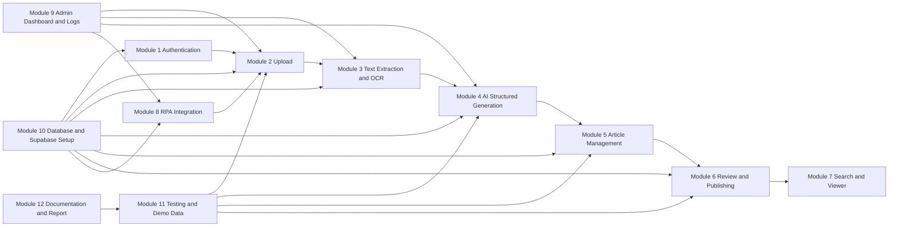
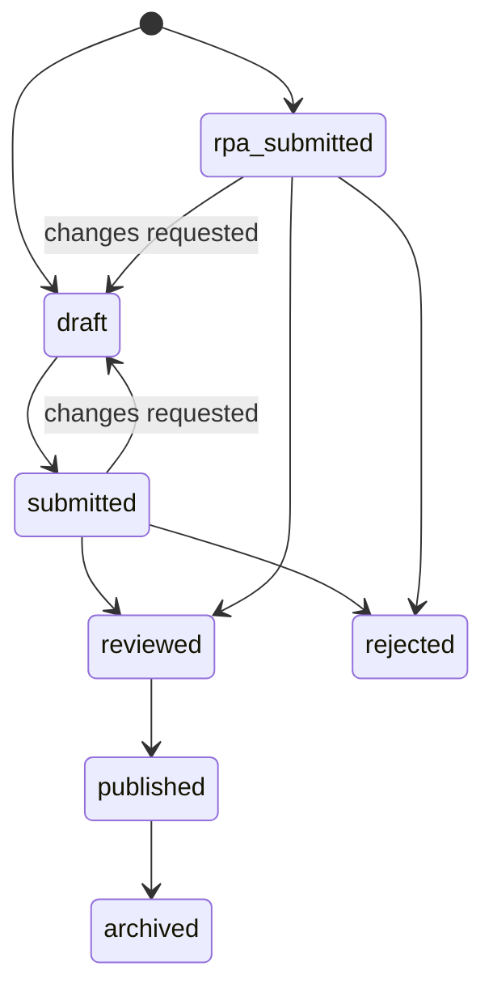
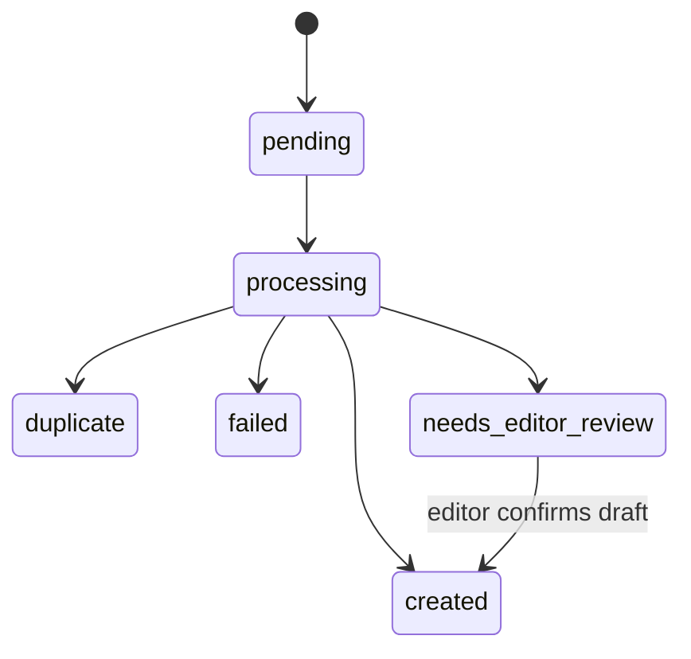
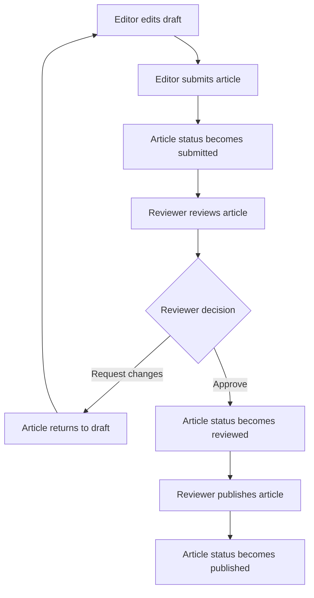

# Project Module Breakdown

## 1. Purpose

This document divides the DHL AI-Powered Knowledge Base Automation system into implementation modules. Each module has clear frontend, backend, database, and deliverable responsibilities.

The current implementation uses the balanced `KBArticleDraft` schema:

```text
title
kind: sop | article
summary
description
steps
sections
keywords
source_reference
source_type
requires_editor_review
```

Long documents above `AI_LONG_DOCUMENT_CHAR_LIMIT` use local heuristic preservation instead of OpenAI full structuring. This keeps the original SOP/PDF/DOCX content available for audit and avoids truncated structured JSON.

## 2. Technology Layers

| Layer | Technology |
| --- | --- |
| Frontend | React + Vite + Tailwind CSS |
| Backend | FastAPI using `uv` |
| Database | PostgreSQL locally, Supabase PostgreSQL as deployment target |
| File storage | Local storage now, Supabase Storage as deployment target |
| OCR | EasyOCR |
| LLM | OpenAI Agents SDK |
| RPA | UiPath Studio |

## 3. Module Overview

| Module | Main responsibility |
| --- | --- |
| Module 1: Authentication and Role Management | Login, user roles, access control |
| Module 2: Upload and Source Document Management | Upload messy inputs and track processing |
| Module 3: Text Extraction and OCR | Extract text from files, images, and screenshots |
| Module 4: AI Structured Article Generation | Use OpenAI Agents SDK and Pydantic validation |
| Module 5: Knowledge Base Article Management | Store, edit, version, and manage article status |
| Module 6: Review and Publishing Workflow | Editor submission, reviewer approval, publishing |
| Module 7: Search and Viewer | Search, filter, and view KB articles |
| Module 8: RPA Integration | UiPath ingestion and summary logging |
| Module 9: Admin Dashboard and Logs | Monitor users, RPA runs, failures, and logs |
| Module 10: Database and Supabase Setup | Tables, enums, policies, storage buckets |
| Module 11: Testing and Demo Data | Test cases, sample source files, demo scenarios |
| Module 12: Documentation and Report Materials | Diagrams, workflows, screenshots, final report |

## 4. Module Dependency Flow



The critical path for the demo is Module 2 through Module 5: upload a messy source, extract usable text, generate a validated draft, and store/edit it as a versioned KB article. Module 6 and Module 7 complete the human approval and search experience. Module 8 adds the UiPath automation story without changing the backend ownership rules.

## 5. Cross-Module API Contract Summary

| Flow | Endpoint | Owner module | Consumer | Main response |
| --- | --- | --- | --- | --- |
| Login | `POST /api/auth/login` | Module 1 | Frontend | Access token and user profile |
| Current user | `GET /api/users/me` | Module 1 | Frontend | Current user role and identity |
| Upload source | `POST /api/uploads` | Module 2 | Frontend, UiPath later | `processing_id`, `processing_status`, `processing_stage` |
| Poll processing | `GET /api/processing/{processing_id}` | Module 2 | Frontend | Source status, generated draft, article summary |
| List articles | `GET /api/articles` | Module 5 and Module 7 | Frontend | Filtered article summaries |
| Article detail | `GET /api/articles/{article_id}` | Module 5 and Module 7 | Frontend | Full structured article content |
| Update draft | `PATCH /api/articles/{article_id}` | Module 5 | Frontend editor | Updated article and new version snapshot |
| Version history | `GET /api/articles/{article_id}/versions` | Module 5 | Frontend editor/reviewer | Article version list |
| Submit review | `POST /api/articles/{article_id}/submit-review` | Module 6 | Frontend editor | Status transition to `submitted` |
| Approve article | `POST /api/articles/{article_id}/approve` | Module 6 | Frontend reviewer | Status transition to `reviewed` |
| Publish article | `POST /api/articles/{article_id}/publish` | Module 6 | Frontend reviewer | Status transition to `published` |
| RPA ingest | `POST /api/rpa/ingest` | Module 8 | UiPath | Created, duplicate, or failed item result |
| Admin logs | `GET /api/logs` | Module 9 | Admin dashboard | Processing, OCR, AI, RPA, and system events |

## 6. Shared Data Contracts

### `KBArticleDraft`

All AI-generated drafts, editor updates, and version snapshots use the same balanced structure.

```text
schema_version: "1.0"
title: string
kind: sop | article
summary: string
description: string
steps: [{ step_no, instruction }]
sections: [{ heading, content }]
keywords: string[]
source_reference: string
source_type: text | email | image | pdf | docx | unknown
requires_editor_review: boolean
```

### Article Lifecycle



### Processing Lifecycle



## 7. Module 1: Authentication and Role Management

### Purpose

Allow users to log in and access features based on their role.

### Roles

| Role | Access |
| --- | --- |
| Editor | Upload messy input, edit drafts, submit articles |
| Reviewer | Review submitted articles, approve, publish |
| Admin | Manage users, view logs, monitor failures |

### Frontend Tasks

- Build login page.
- Store logged-in user session.
- Show navigation based on user role.
- Protect pages from unauthorized users.

### Backend Tasks

- Create login/profile API endpoints.
- Validate user role before protected actions.
- Seed demo users for local testing.

### Database Tables

- `app_users`

### Deliverables

- Working login.
- Role-based navigation.
- Role-based backend authorization.

## 8. Module 2: Upload and Source Document Management

### Purpose

Allow editors to upload messy operational source files and track backend processing.

### Supported Inputs

- Plain text
- PDF
- DOCX
- Email/message export
- Image or screenshot

### Frontend Tasks

- Build upload console.
- Validate file type.
- Show upload success or failure.
- Receive `processing_id`.
- Poll `/api/processing/{processing_id}` until complete.
- Show generated draft JSON after completion.

### Backend Tasks

- Create upload API.
- Save original file metadata.
- Store file in configured storage.
- Create `source_documents` record.
- Return `processing_id` immediately.
- Update processing status during extraction, duplicate detection, OCR, AI generation, and failure handling.

### Database Tables

- `source_documents`
- `attachments`
- `system_logs`

### API Contract

| Method | Endpoint | Request | Response |
| --- | --- | --- | --- |
| `POST` | `/api/uploads` | Multipart file | `UploadResponse` with `processing_id` |
| `GET` | `/api/processing/{processing_id}` | Path ID | `ProcessingStatusResponse` |

### Deliverables

- Upload page.
- Processing status polling.
- Source document records stored in database.

## 9. Module 3: Text Extraction and OCR

### Purpose

Extract usable text from uploaded files before AI generation.

### Extraction Rules

| Source type | Processing method |
| --- | --- |
| `.txt`, `.md`, `.csv`, `.log` | Direct text read |
| `.pdf` | PDF text extraction |
| `.docx` | DOCX text extraction |
| `.eml`, `.msg` | Email body parsing |
| Image/screenshot | EasyOCR |

### Backend Tasks

- Detect file type.
- Extract text from text, PDF, DOCX, and email files.
- Run EasyOCR for image/screenshot files.
- Store `raw_text` and `extracted_text`.
- Store OCR confidence.
- Mark poor OCR output as `needs_editor_review`.

### OCR Rules

- OCR output can create a draft.
- OCR output must not be published automatically.
- If confidence is poor, set `requires_editor_review = true`.

### Database Tables

- `source_documents`
- `ocr_results`
- `system_logs`

### Deliverables

- Text extraction service.
- EasyOCR integration.
- OCR confidence handling.

## 10. Module 4: AI Structured Article Generation

### Purpose

Use the OpenAI Agents SDK to convert extracted text into balanced structured article JSON.

### Backend Tasks

- Define `KBArticleDraft` Pydantic model.
- Create `AGENT_INSTRUCTIONS`.
- Create `build_agent_input()`.
- Cache the `Agent` with `get_kb_article_agent()`.
- Call `Runner.run_sync(..., max_turns=1)`.
- Route long documents above `ai_long_document_char_limit` to heuristic preservation mode before any OpenAI call.
- Validate structured output using Pydantic.
- Retry if response is invalid, incomplete, timed out, or fails schema validation.
- Store AI result in `ai_generation_runs`.

### Pydantic Output Fields

- `schema_version`
- `title`
- `kind`
- `summary`
- `description`
- `steps`
- `sections`
- `keywords`
- `source_reference`
- `source_type`
- `requires_editor_review`

### Long Document Preservation Mode

| Item | Behavior |
| --- | --- |
| Trigger | `len(extracted_text) > ai_long_document_char_limit`, default `3000` |
| Provider | `heuristic` |
| Model name | `local-preservation-heuristic` |
| Workflow | `kb-article-long-document-preservation` |
| Description | Cleaned original source text, capped at `20000` chars |
| Steps | Empty list |
| Sections | Extracted locally from source headings, capped at `5000` chars each |
| Review | `requires_editor_review = true` |

### Kind Classification

| Kind | Use for |
| --- | --- |
| `sop` | Repeatable procedures, checklists, onboarding steps, approval flows |
| `article` | Troubleshooting notes, fixes, FAQs, explanations, reminders, general knowledge |

### Retry Rules

| Rule | Value |
| --- | --- |
| Maximum retries | `3` |
| Retry invalid JSON | Yes |
| Retry Pydantic validation error | Yes |
| Retry timeout | Yes |
| Store validation error | Yes |

### Database Tables

- `ai_generation_runs`
- `kb_articles`
- `article_versions`
- `keywords`
- `article_keywords`

### Deliverables

- OpenAI Agents SDK generation pipeline.
- Pydantic structured output validation.
- AI retry handling.
- Valid JSON article creation.

## 11. Module 5: Knowledge Base Article Management

### Purpose

Store, edit, and version Knowledge Base articles.

### Frontend Tasks

- Build draft editor page.
- Display structured article fields as editable form sections.
- Allow editor to update title, kind, summary, description, steps, sections, keywords, and source reference.
- Save draft changes.
- Show article status clearly.
- Show version history.

### Backend Tasks

- Create article list/detail/update APIs.
- Store full JSON in `kb_articles.structured_content`.
- Keep direct database columns aligned with `KBArticleDraft`.
- Save each edit as a new version.
- Normalize keywords.

### Stored Article Fields

- `kind`
- `title`
- `summary`
- `description`
- `steps`
- `sections`
- `keywords`
- `structured_content`
- `status`
- `requires_editor_review`
- `current_version_no`

### Article Statuses

| Status | Meaning |
| --- | --- |
| `draft` | Created but not submitted |
| `submitted` | Submitted by editor |
| `rpa_submitted` | Created by UiPath and sent to reviewer queue |
| `reviewed` | Approved by reviewer |
| `published` | Visible in KB viewer |
| `rejected` | Rejected by reviewer |
| `archived` | Retired article |

### Database Tables

- `kb_articles`
- `article_versions`
- `article_sources`
- `keywords`
- `article_keywords`

### API Contract

| Method | Endpoint | Purpose |
| --- | --- | --- |
| `GET` | `/api/articles` | List/search articles |
| `GET` | `/api/articles/{article_id}` | Article detail |
| `PATCH` | `/api/articles/{article_id}` | Update `KBArticleDraft` fields |
| `GET` | `/api/articles/{article_id}/versions` | Version history |

### Deliverables

- Draft editor.
- Article update API.
- Version history creation.

## 12. Module 6: Review and Publishing Workflow

### Purpose

Support the human approval flow from draft to published article.

### Workflow



### Frontend Tasks

- Build editor submit button.
- Build reviewer queue.
- Show `submitted` and `rpa_submitted` articles.
- Highlight RPA-generated articles for reviewer attention.
- Allow reviewer to approve, reject, request changes, or publish.

### Backend Tasks

- Create submit, approve, reject, request changes, and publish endpoints.
- Store review events.
- Update article status.
- Save version history when status changes.

### Database Tables

- `kb_articles`
- `review_events` planned
- `article_versions`

### Deliverables

- Reviewer queue.
- Status transition APIs.
- Review event history.

## 13. Module 7: Search and Viewer

### Purpose

Allow users to search, filter, and read approved/published Knowledge Base articles.

### Frontend Tasks

- Build article list page.
- Build article detail page.
- Add filters by status, keyword, date, creator, kind, and source type.
- Show published articles clearly for normal KB usage.

### Backend Tasks

- Create search/filter API.
- Return article JSON to frontend.
- Support pagination later.
- Support keyword and status filters later.

### Database Tables

- `kb_articles`
- `keywords`
- `article_keywords`
- `article_sources`

### Deliverables

- Searchable KB viewer.
- Filterable article list.
- Article detail page.

## 14. Module 8: RPA Integration

### Purpose

Use UiPath to detect new files and send them to FastAPI for processing.

### UiPath Responsibilities

UiPath should only:

1. Detect new files.
2. Send file/text to FastAPI.
3. Receive result from API.
4. Log created, duplicate, or failed.
5. Take screenshot if error.
6. Send summary email.

### FastAPI Responsibilities

FastAPI should:

- Extract text.
- Generate hash.
- Check duplicates.
- Run OCR if needed.
- Call AI.
- Store JSON article.
- Save version history.
- Store logs.

### RPA Status Rule

- Successful RPA-created article should use `rpa_submitted`.
- If OCR is poor or incomplete, keep status as `draft` and set `requires_editor_review = true`.

### Database Tables

- `rpa_runs` planned
- `rpa_run_items` planned
- `source_documents`
- `kb_articles`
- `system_logs`

### Deliverables

- UiPath workflow.
- RPA API integration.
- RPA summary email.
- Failure screenshot handling.

## 15. Module 9: Admin Dashboard and Logs

### Purpose

Allow admins to monitor system usage, processing failures, and logs.

### Frontend Tasks

- Build admin dashboard.
- Show user list.
- Show failed items.
- Show duplicate items.
- Show OCR/AI failures.
- Show RPA run summaries when RPA module is implemented.

### Backend Tasks

- Create admin log APIs.
- Return system logs.
- Return failed processing records.
- Return RPA run summaries later.

### Database Tables

- `app_users`
- `system_logs`
- `source_documents`
- `ai_generation_runs`
- `ocr_results`
- `rpa_runs` planned
- `rpa_run_items` planned

### Deliverables

- Admin dashboard.
- Failure log viewer.
- RPA monitoring page.

## 16. Module 10: Database and Supabase Setup

### Purpose

Prepare PostgreSQL development schema, Supabase deployment compatibility, and storage setup.

### Tasks

- Configure FastAPI to connect to PostgreSQL.
- Keep deployment target compatible with Supabase PostgreSQL.
- Do not use SQLite as the development fallback.
- Create database enums.
- Create tables and foreign keys.
- Create indexes.
- Create storage bucket for uploaded files.
- Create storage bucket for RPA screenshots/logs.
- Add seed users for editor, reviewer, and admin.

### Recommended Indexes

| Table | Index |
| --- | --- |
| `kb_articles` | `status` |
| `kb_articles` | `kind` |
| `kb_articles` | `slug` |
| `kb_articles` | `created_by` |
| `kb_articles` | `updated_at` |
| `source_documents` | `content_hash` |
| `source_documents` | `processing_status` |
| `ai_generation_runs` | `input_text_hash` |
| `keywords` | `name` |
| `system_logs` | `severity`, `created_at` |

### Deliverables

- Local PostgreSQL development configuration.
- Supabase-compatible database schema.
- Supabase storage setup.
- Seed data.

## 17. Module 11: Testing and Demo Data

### Purpose

Verify features and prepare a good demonstration.

### Test Scenarios

| Scenario | Expected result |
| --- | --- |
| Upload `Error_Code_AUTH_401.txt` | Draft article created |
| Real OpenAI troubleshooting note | `kind = article` |
| Real OpenAI SOP source | `kind = sop` |
| Long SOP source over 3000 chars | Heuristic preservation mode, no OpenAI call |
| Real OpenAI checklist source | `kind = sop` |
| Real OpenAI FAQ-like source | `kind = article` |
| Upload duplicate file within 14 days | Duplicate detected |
| Upload screenshot | EasyOCR extracts text and draft is flagged for review if needed |
| Edit draft article | New version created |
| Submit draft as editor | Status becomes `submitted` |
| Approve as reviewer | Status becomes `reviewed` |
| Publish as reviewer | Status becomes `published` |
| RPA sends source file | Article becomes `rpa_submitted`, duplicate, or failed |
| AI returns invalid output | Retry happens and error is logged if still failed |

### Test Files

| File | Purpose |
| --- | --- |
| `backend/tests/test_connection.py` | Database and optional OpenAI connectivity |
| `backend/tests/test_upload_processing.py` | Upload, duplicate, email, and OCR processing |
| `backend/tests/test_article_generation_management.py` | Article creation, keyword persistence, updates, versions |
| `backend/tests/test_ai_article_generation_management.py` | Real OpenAI Agents SDK generation |

### Deliverables

- Manual test checklist.
- Automated backend tests.
- Demo data setup.
- Screenshots for report.

## 18. Module 12: Documentation and Report Materials

### Purpose

Prepare documents needed for project submission and presentation.

### Tasks

- Update README.
- Include system architecture diagram.
- Include database schema.
- Include workflow diagrams.
- Include RPA workflow diagram.
- Include screenshots of frontend pages.
- Explain AI, OCR, and RPA responsibilities.
- Explain limitations and future enhancements.

### Deliverables

- Final README.
- Final report sections.
- RPA workflow explanation.
- Screenshots and diagrams.

## 19. Suggested Implementation Order

| Phase | Modules |
| --- | --- |
| Phase 1: Foundation | Module 10, Module 1 |
| Phase 2: Core Upload Flow | Module 2, Module 3 |
| Phase 3: AI Draft Generation | Module 4, Module 5 |
| Phase 4: Human Review Flow | Module 6, Module 7 |
| Phase 5: RPA and Admin | Module 8, Module 9 |
| Phase 6: Finalization | Module 11, Module 12 |
