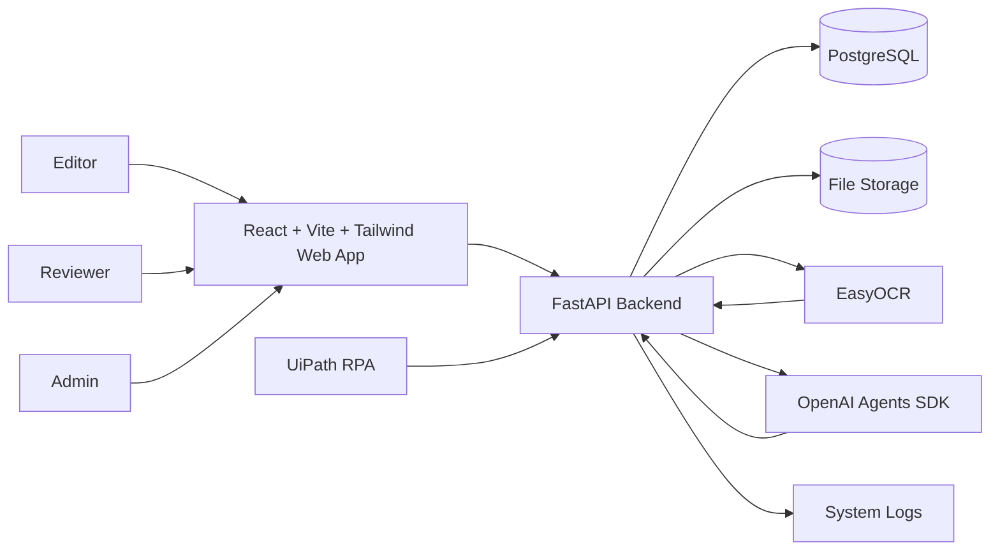
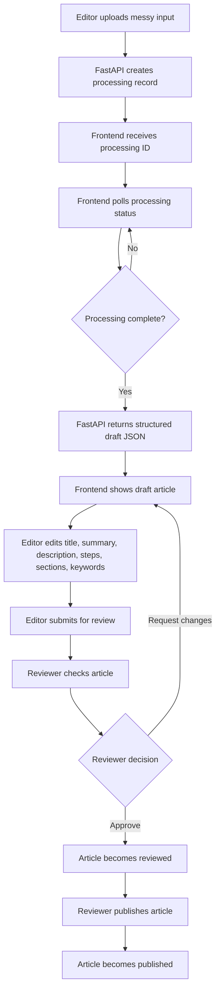
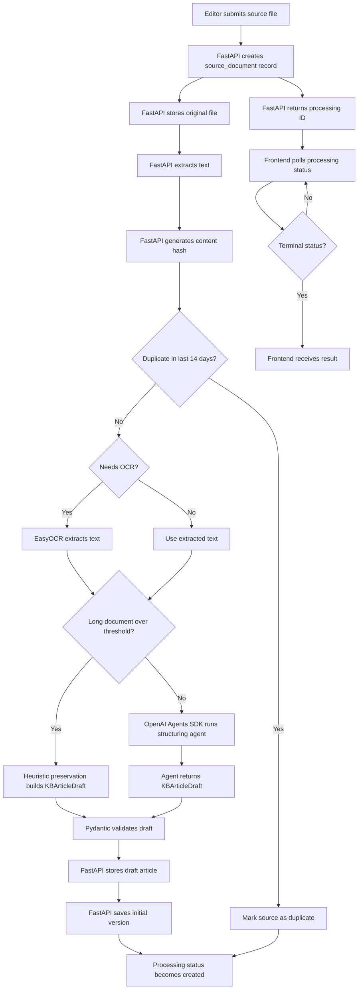
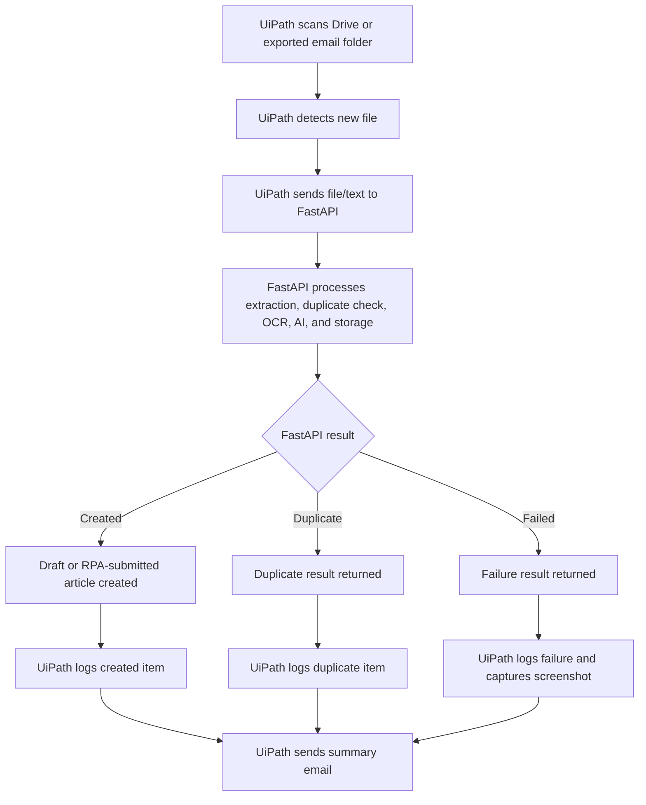
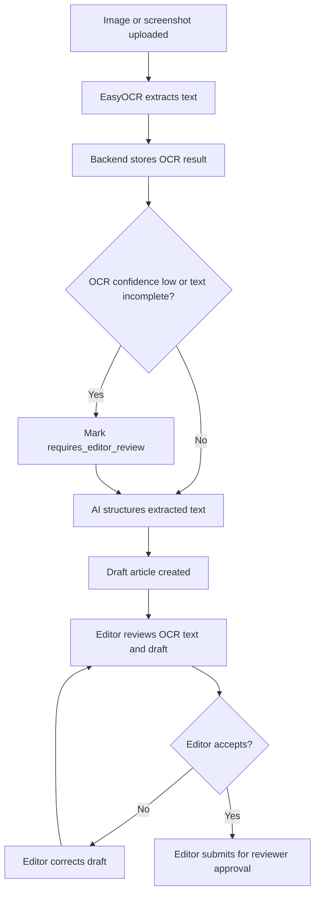
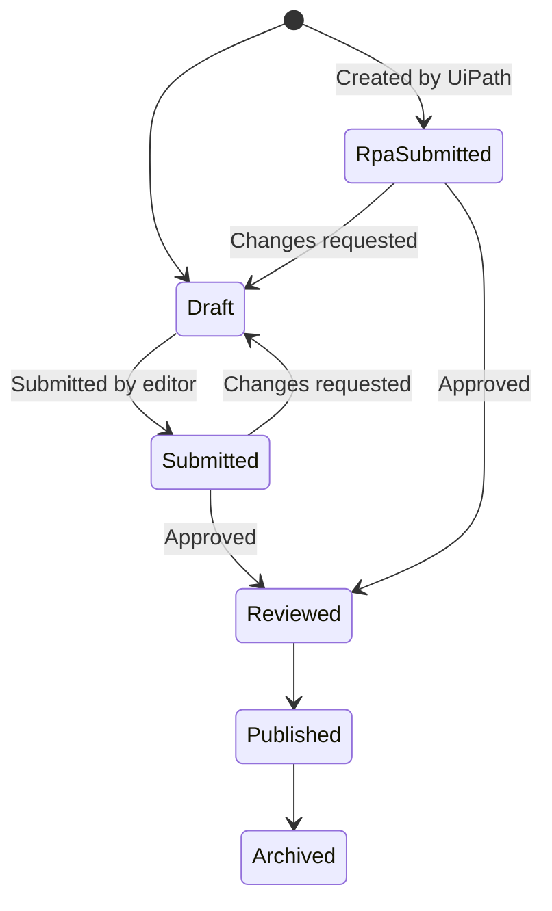
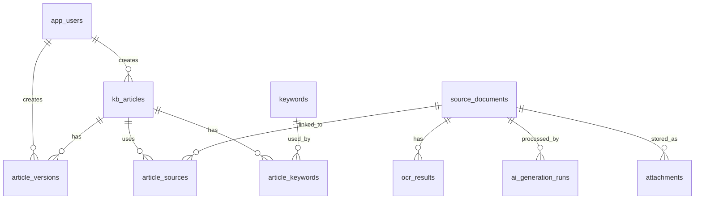

# Database Schema, System Workflow, and Architecture

## 1. Project Context

The DHL Logistics Operations source data contains useful knowledge, but it is spread across inconsistent formats.

| Source example | Current format | Knowledge contained |
| --- | --- | --- |
| `SOP_Customer Credit Approval and New Customer Onboarding Process.txt` | Long SOP draft | Customer onboarding, credit approval, system setup, escalation |
| `SOP.txt` | Mixed background notes | Shipment exception handling and operational gaps |
| `Customer_address_invalid..txt` | Short informal note | Missing postcode fix for customer address validation |
| `Error_Code_AUTH_401.txt` | Error resolution note | Authorization failure and AD group access fix |
| `Label_not_printing_properly..txt` | Quick troubleshooting note | Printer cache, queue clearing, toner replacement |
| `New_staff_setup_steps.txt` | Checklist-style note | New staff account, email, SAP, CW1, SOP folder setup |
| `Outlook_message.txt` | Email message | Invoice mismatch caused by duplicated fuel surcharge |
| `POD_upload_failed_again.txt` | Chat-style fix | Compress POD image, prefer JPEG, refresh after upload |
| `Teams_Message.jpg` | Teams screenshot | Invalid routing code resolution |
| `Teams_Message_2.jpg` | Teams screenshot | Booking validation checklist |

The system converts messy operational inputs into clean, searchable, reviewed SOPs and knowledge-base articles.

## 2. Core Problem

Operational knowledge is scattered across chats, emails, screenshots, draft SOPs, and informal notes.

| Problem | Impact |
| --- | --- |
| Knowledge is unstructured | Staff cannot quickly search or reuse solutions |
| Different agents use different steps | Resolutions become inconsistent |
| Important fixes are hidden in chats and emails | Repeated errors happen |
| New joiners depend on experienced staff | Training is slow and informal |
| SOP drafts are not standardized | Review and publishing take longer |
| No central audit trail | Managers cannot track ownership, changes, or failures easily |

## 3. Target Outcome

The target system is an AI-assisted Knowledge Base automation platform.

The system should:

- Accept messy operational inputs from editors or UiPath RPA.
- Extract usable text from text files, PDFs, DOCX files, emails, and screenshots.
- Use EasyOCR for image and screenshot text extraction.
- Use the OpenAI Agents SDK to structure short draft content in one schema-validated run.
- Use heuristic preservation mode for long SOP/PDF/DOCX content instead of asking the LLM to regenerate the full document.
- Save every generated article as a draft first.
- Keep OCR or ambiguous AI output flagged for editor review.
- Support reviewer approval before publication.
- Keep version history for auditability.
- Store AI runs, duplicate checks, failures, and system logs.

## 4. Technology Stack

| Layer | Technology |
| --- | --- |
| Frontend | React + Vite + Tailwind CSS |
| Backend | FastAPI using `uv` virtual environment |
| Database | PostgreSQL on localhost for development, Supabase PostgreSQL as deployment target |
| File storage | Local filesystem for current backend implementation, Supabase Storage as deployment target |
| RPA | UiPath Studio |
| OCR | EasyOCR |
| LLM | OpenAI Agents SDK with structured Pydantic output |

## 5. User Roles

| Role | Main purpose |
| --- | --- |
| Editor | Upload sources, edit generated drafts, submit articles |
| Reviewer | Review, approve, and publish articles |
| Admin | Manage users and monitor logs/failures |

## 6. Role Permissions

| Feature | Editor | Reviewer | Admin |
| --- | --- | --- | --- |
| Upload messy source input | Yes | Optional | Yes |
| View draft articles | Own/team drafts | Yes | Yes |
| Edit draft articles | Yes | Comment/request changes | Yes |
| Submit article for review | Yes | Yes | Yes |
| Approve reviewed article | No | Yes | Yes |
| Publish article | No | Yes | Yes |
| Manage users | No | No | Yes |
| View RPA logs | No | Optional read-only | Yes |
| View system failures | No | Optional read-only | Yes |

## 7. High-Level Architecture



## 8. Component Responsibilities

### 8.1 React Frontend

The frontend should provide:

- Login and role-based navigation.
- Upload console for text, PDF, DOCX, email, and image files.
- Processing-status polling.
- Draft article editor.
- Review queue.
- Published knowledge-base viewer.
- Search and filter by keyword, status, date, creator, source type, and kind.
- Admin dashboard for users, duplicate records, failures, and logs.

### 8.2 FastAPI Backend

FastAPI owns the business logic.

FastAPI should:

1. Store uploaded source files.
2. Extract text.
3. Generate normalized content hashes.
4. Check duplicates.
5. Run OCR when needed.
6. Call the OpenAI Agents SDK.
7. Validate AI output using Pydantic.
8. Retry AI generation when responses are invalid, incomplete, or timed out.
9. Create KB article records from validated output.
10. Save version history.
11. Store AI and system logs.

For local development, FastAPI connects to PostgreSQL by default. If `DATABASE_URL` is supplied, the backend uses that connection string.

### 8.3 UiPath RPA

UiPath should remain a lightweight ingestion bot.

UiPath should only:

1. Detect new files.
2. Send file/text to FastAPI.
3. Receive result from API.
4. Log created, duplicate, or failed outcomes.
5. Take screenshots if an error occurs.
6. Send summary email.

UiPath should not generate final article content, decide publishability, perform OCR directly, call OpenAI directly, update the database directly, or bypass editor/reviewer approval.

### 8.4 EasyOCR

EasyOCR is used for image and screenshot inputs.

EasyOCR should:

- Extract text from uploaded images.
- Store extracted text and confidence metadata.
- Mark low-confidence extraction for editor review.

OCR output must be reviewed before publication.

### 8.5 OpenAI Agents SDK

The OpenAI Agents SDK is used to:

- Classify the draft as `sop` or `article`.
- Generate the article title.
- Summarize source text.
- Produce a clear `description`.
- Extract ordered `steps`.
- Group supporting content into `sections`.
- Suggest normalized `keywords`.

The current implementation uses one cached KB Article Structuring Agent with `KBArticleDraft` as its `output_type` for short inputs. The agent runs once per generation with `max_turns=1`. Long inputs above `ai_long_document_char_limit` skip OpenAI and use local heuristic preservation so the original SOP content is kept in the article description.

## 9. System Workflow

### 9.1 Main Human Workflow



### 9.2 Upload and Draft Creation Workflow



### 9.3 RPA Ingestion Workflow



### 9.4 OCR Workflow



### 9.5 Article Status Lifecycle



| Status | Meaning |
| --- | --- |
| `draft` | Created by system, AI, or editor. Not submitted to reviewer yet. |
| `submitted` | Editor has reviewed and submitted it. |
| `rpa_submitted` | Created through UiPath and sent to reviewer queue. |
| `reviewed` | Reviewer has approved the content. |
| `published` | Article is visible in the Knowledge Base. |
| `rejected` | Reviewer rejected the draft. |
| `archived` | Article is no longer active but kept for audit/history. |

## 10. API Contract

### 10.1 Endpoint Overview

| Method | Endpoint | Purpose | Current status |
| --- | --- | --- | --- |
| `POST` | `/api/auth/login` | User login | Implemented |
| `GET` | `/api/users/me` | Get current user profile | Implemented |
| `POST` | `/api/uploads` | Upload a source file and return `processing_id` | Implemented |
| `GET` | `/api/processing/{processing_id}` | Poll source processing status | Implemented |
| `GET` | `/api/articles` | List/search articles | Implemented |
| `GET` | `/api/articles/{article_id}` | View article details | Implemented |
| `PATCH` | `/api/articles/{article_id}` | Edit structured draft content | Implemented |
| `GET` | `/api/articles/{article_id}/versions` | View article version history | Implemented |
| `POST` | `/api/rpa/ingest` | UiPath ingestion endpoint | Implemented |
| `POST` | `/api/articles/{article_id}/submit-review` | Submit draft for review | Implemented |
| `POST` | `/api/articles/{article_id}/approve` | Reviewer approval | Implemented |
| `POST` | `/api/articles/{article_id}/publish` | Publish reviewed article | Implemented |
| `GET` | `/api/logs` | Admin log viewer | Planned |

### 10.2 `POST /api/uploads`

Request:

```http
POST /api/uploads
Content-Type: multipart/form-data
Authorization: Bearer <token>
```

Response:

```json
{
  "processing_id": "source-document-uuid",
  "processing_status": "pending",
  "processing_stage": "queued"
}
```

### 10.3 `GET /api/processing/{processing_id}`

Response shape:

```json
{
  "processing_id": "source-document-uuid",
  "processing_status": "created",
  "processing_stage": "completed",
  "source_document": {
    "id": "source-document-uuid",
    "original_filename": "Error_Code_AUTH_401.txt",
    "source_type": "text",
    "requires_editor_review": false
  },
  "generated_draft": {
    "title": "Resolve AUTH_401 Access Failure",
    "summary": "Steps to resolve missing access for a forwarding module.",
    "kind": "article",
    "source_reference": "Error_Code_AUTH_401.txt",
    "keywords": ["authorization", "auth-401"],
    "steps": [
      {"step_no": 1, "instruction": "Check the user's AD group membership."}
    ]
  },
  "article": {
    "id": "article-uuid",
    "kind": "article",
    "status": "draft",
    "structured_content": {}
  }
}
```

### 10.4 `POST /api/rpa/ingest`

Request:

```http
POST /api/rpa/ingest
Content-Type: multipart/form-data
```

Behavior:

- The endpoint reuses the existing backend extraction, duplicate-detection, OCR, AI, and article-creation pipeline.
- Unlike `/api/uploads`, it waits for processing to reach a terminal state and returns the final result directly.
- For MVP and local development, the endpoint is unauthenticated.
- Preferred request mode is multipart file upload.
- For compatibility with the current local UiPath implementation, the backend also accepts a readable local file path in `file` when the bot and API run on the same machine.

Response shape:

```json
{
  "status": "created",
  "processing_id": "source-document-uuid",
  "article_id": "article-uuid",
  "source_document_id": "source-document-uuid",
  "duplicate_of_source_id": null,
  "message": "Draft article created",
  "requires_editor_review": false
}
```

Status rules:

- `created`: article was created and stored as `rpa_submitted`
- `needs_editor_review`: article was created and stored as `draft` with `requires_editor_review = true`
- `duplicate`: duplicate source detected within the duplicate lookback window
- `failed`: backend could not complete the ingestion flow and returns a contract-shaped failure response when possible

### 10.5 `PATCH /api/articles/{article_id}`

Request body is `ArticleUpdatePayload`, which extends `KBArticleDraft` with `change_note`.

```json
{
  "schema_version": "1.0",
  "title": "Resolve AUTH_401 Access Failure",
  "kind": "article",
  "summary": "Validated draft for missing AD group access.",
  "description": "Users cannot access the forwarding module because access assignment is incomplete.",
  "steps": [
    {"step_no": 1, "instruction": "Check the user's AD group membership."},
    {"step_no": 2, "instruction": "Assign the missing forwarding access group."}
  ],
  "sections": [
    {"heading": "Cause", "content": "The required AD group access was not assigned."}
  ],
  "keywords": ["authorization", "auth-401", "forwarding"],
  "source_reference": "Error_Code_AUTH_401.txt",
  "source_type": "text",
  "requires_editor_review": false,
  "change_note": "Clarified access steps."
}
```

### 10.5 Article Detail Response

```json
{
  "id": "article-uuid",
  "title": "Resolve AUTH_401 Access Failure",
  "summary": "Validated draft for missing AD group access.",
  "kind": "article",
  "status": "draft",
  "description": "Users cannot access the forwarding module because access assignment is incomplete.",
  "steps": [
    {"step_no": 1, "instruction": "Check the user's AD group membership."}
  ],
  "sections": [
    {"heading": "Cause", "content": "The required AD group access was not assigned."}
  ],
  "keywords": ["authorization", "auth-401"],
  "structured_content": {
    "schema_version": "1.0",
    "kind": "article"
  }
}
```

## 11. Database Schema

### 11.1 Entity Relationship Overview



### 11.2 Enum Values

#### `user_role`

| Value | Description |
| --- | --- |
| `editor` | Can create and edit draft articles |
| `reviewer` | Can review, approve, and publish articles |
| `admin` | Can manage users, logs, and monitoring |

#### `article_status`

| Value | Description |
| --- | --- |
| `draft` | Editable article draft |
| `submitted` | Waiting for reviewer action |
| `rpa_submitted` | Submitted by UiPath and waiting for reviewer action when no review flag is required |
| `reviewed` | Approved but not necessarily published |
| `published` | Visible in the Knowledge Base |
| `rejected` | Rejected by reviewer |
| `archived` | Retired article |

#### `source_type`

| Value | Description |
| --- | --- |
| `text` | Plain text note |
| `pdf` | PDF document |
| `docx` | Word document |
| `email` | Exported email or message |
| `image` | Image source |
| `chat_screenshot` | Screenshot from Teams or chat |
| `rpa_import` | File received through UiPath |

#### `processing_status`

| Value | Description |
| --- | --- |
| `pending` | Waiting to be processed |
| `processing` | Currently being processed |
| `created` | Draft article created |
| `duplicate` | Duplicate detected |
| `failed` | Processing failed |
| `needs_editor_review` | OCR, AI, or long-document preservation output needs human review |

### 11.3 `app_users`

| Column | Type | Constraints | Description |
| --- | --- | --- | --- |
| `id` | `uuid` | Primary key | Internal user ID |
| `login_id` | `text` | Unique | Login identifier |
| `full_name` | `text` | Not null | User display name |
| `email` | `text` | Unique | User email |
| `password_hash` | `text` | Not null | Local password hash |
| `role` | `user_role` | Not null | Editor, reviewer, or admin |
| `is_active` | `boolean` | Default `true` | Whether account can access the system |
| `created_at` | `timestamptz` | Default `now()` | Creation timestamp |
| `updated_at` | `timestamptz` | Default `now()` | Last update timestamp |

### 11.4 `kb_articles`

| Column | Type | Constraints | Description |
| --- | --- | --- | --- |
| `id` | `uuid` | Primary key | Article ID |
| `kind` | `text` | Not null | `sop` or `article` |
| `title` | `text` | Not null, indexed | Article title |
| `slug` | `text` | Unique, indexed | URL-friendly article identifier |
| `summary` | `text` | Nullable | Short article summary |
| `description` | `text` | Nullable | Main article body |
| `steps` | `jsonb` | Nullable | Ordered `ArticleStep` list |
| `sections` | `jsonb` | Nullable | Grouped `ArticleSection` list |
| `keywords` | `jsonb` | Nullable | Keyword labels stored with the draft |
| `structured_content` | `jsonb` | Not null | Full validated `KBArticleDraft` |
| `status` | `article_status` | Default `draft`, indexed | Current lifecycle status |
| `created_via` | `text` | Default `manual_upload` | Source of article creation |
| `requires_editor_review` | `boolean` | Default `false` | True when source/draft needs review |
| `current_version_no` | `integer` | Default `1` | Current version number |
| `created_by` | `uuid` | FK to `app_users.id`, nullable | Creator |
| `updated_by` | `uuid` | FK to `app_users.id`, nullable | Last updater |
| `reviewed_by` | `uuid` | FK to `app_users.id`, nullable | Reviewer |
| `published_by` | `uuid` | FK to `app_users.id`, nullable | Publisher |
| `reviewed_at` | `timestamptz` | Nullable | Review timestamp |
| `published_at` | `timestamptz` | Nullable | Publish timestamp |
| `created_at` | `timestamptz` | Default `now()` | Creation timestamp |
| `updated_at` | `timestamptz` | Default `now()` | Last update timestamp |

### 11.5 `article_versions`

| Column | Type | Constraints | Description |
| --- | --- | --- | --- |
| `id` | `uuid` | Primary key | Version ID |
| `article_id` | `uuid` | FK to `kb_articles.id` | Article |
| `version_no` | `integer` | Unique per article | Version number |
| `title` | `text` | Not null | Snapshot title |
| `summary` | `text` | Nullable | Snapshot summary |
| `structured_content` | `jsonb` | Not null | Snapshot `KBArticleDraft` |
| `status_snapshot` | `article_status` | Not null | Status at version creation |
| `change_note` | `text` | Nullable | Editor/reviewer note |
| `created_by` | `uuid` | FK to `app_users.id`, nullable | Actor |
| `created_at` | `timestamptz` | Default `now()` | Creation timestamp |

### 11.6 `source_documents`

| Column | Type | Constraints | Description |
| --- | --- | --- | --- |
| `id` | `uuid` | Primary key | Source record ID |
| `original_filename` | `text` | Not null | Uploaded file name |
| `source_type` | `source_type` | Not null | Source category |
| `ingestion_method` | `text` | Default `manual_upload` | Manual upload, RPA, or system |
| `storage_path` | `text` | Not null | Stored file location |
| `mime_type` | `text` | Nullable | MIME type |
| `raw_text` | `text` | Nullable | Raw extracted text |
| `extracted_text` | `text` | Nullable | Normalized text used for AI |
| `content_hash` | `text` | Indexed, nullable | Normalized text hash |
| `file_hash` | `text` | Nullable | Original file hash |
| `processing_status` | `processing_status` | Indexed | Current processing status |
| `processing_stage` | `text` | Not null | Current processing stage |
| `processing_error` | `text` | Nullable | Failure reason |
| `duplicate_of_source_id` | `uuid` | FK to `source_documents.id`, nullable | Duplicate source |
| `requires_editor_review` | `boolean` | Default `false` | Review flag |
| `uploaded_by` | `uuid` | FK to `app_users.id`, nullable | Uploader |
| `created_at` | `timestamptz` | Default `now()` | Creation timestamp |
| `processed_at` | `timestamptz` | Nullable | Processing completion timestamp |

### 11.7 Supporting Tables

| Table | Purpose |
| --- | --- |
| `article_sources` | Links articles to source documents |
| `attachments` | Stores uploaded file references |
| `ocr_results` | Stores OCR extracted text and confidence |
| `ai_generation_runs` | Stores provider/model/workflow/schema audit details |
| `keywords` | Reusable keyword labels |
| `article_keywords` | Article-to-keyword join table |
| `system_logs` | Backend, OCR, AI, and processing events |

## 12. Article Structure Generated by AI

The LLM must return structured JSON that matches `KBArticleDraft`. FastAPI validates it first, then stores it in `kb_articles.structured_content` and `article_versions.structured_content`.

### 12.1 Pydantic Structured Output Model

```python
class ArticleKind(StrEnum):
    SOP = "sop"
    ARTICLE = "article"


class SourceType(StrEnum):
    TEXT = "text"
    EMAIL = "email"
    IMAGE = "image"
    PDF = "pdf"
    DOCX = "docx"
    UNKNOWN = "unknown"


class ArticleSection(BaseModel):
    heading: str = Field(..., min_length=3, max_length=120)
    content: str = Field(..., min_length=3, max_length=5000)


class ArticleStep(BaseModel):
    step_no: int = Field(..., ge=1)
    instruction: str = Field(..., min_length=3, max_length=500)


class KBArticleDraft(BaseModel):
    schema_version: Literal["1.0"] = "1.0"
    title: str = Field(..., min_length=5, max_length=160)
    kind: ArticleKind
    summary: str = Field(..., min_length=10, max_length=700)
    description: str = Field(..., min_length=20, max_length=20000)
    steps: list[ArticleStep] = Field(default_factory=list)
    sections: list[ArticleSection] = Field(default_factory=list)
    keywords: list[str] = Field(default_factory=list, max_length=8)
    source_reference: str = Field(..., min_length=1, max_length=300)
    source_type: SourceType = SourceType.UNKNOWN
    requires_editor_review: bool = True
```

### 12.2 AI Retry Configuration

| Setting | Recommended value | Purpose |
| --- | --- | --- |
| `ai_max_retries` | `3` | Prevent infinite AI retry loops |
| Retry invalid JSON | Yes | Retry if the agent returns invalid JSON |
| Retry schema error | Yes | Retry if Pydantic validation fails |
| Retry timeout | Yes | Retry when the AI request times out |
| Backoff | Exponential | Wait longer between attempts |
| Store validation error | Yes | Save failure in `ai_generation_runs.validation_error` |

### 12.3 Database Storage Rule

| Field | Storage location |
| --- | --- |
| Full validated object | `kb_articles.structured_content` |
| Title | `kb_articles.title` |
| Kind | `kb_articles.kind` |
| Summary | `kb_articles.summary` |
| Description | `kb_articles.description` |
| Steps | `kb_articles.steps` |
| Sections | `kb_articles.sections` |
| Keywords | `kb_articles.keywords`, `keywords`, `article_keywords` |
| AI trace | `ai_generation_runs.output_json` |
| Version snapshot | `article_versions.structured_content` |

### 12.4 Long Document Preservation Rule

| Rule | Value |
| --- | --- |
| Threshold | `ai_long_document_char_limit`, default `3000` characters |
| Provider | `heuristic` |
| Workflow | `kb-article-long-document-preservation` |
| Description | Cleaned original source text, capped by schema at `20000` characters |
| Steps | Empty list; long SOP steps remain preserved in description/sections |
| Sections | Deterministically split from source headings, capped at `5000` chars each |
| Review flag | `requires_editor_review = true` |

## 13. Example Drafts

### 13.1 SOP Example

```json
{
  "schema_version": "1.0",
  "title": "New Staff System Setup SOP",
  "kind": "sop",
  "summary": "Steps for setting up access for a new staff member.",
  "description": "This SOP explains how to prepare system access for new staff.",
  "steps": [
    {"step_no": 1, "instruction": "Create the AD account."},
    {"step_no": 2, "instruction": "Give email access."},
    {"step_no": 3, "instruction": "Assign SAP and CW1 roles."},
    {"step_no": 4, "instruction": "Share the SOP folder."}
  ],
  "sections": [
    {"heading": "Important Note", "content": "Setup may be delayed if the SAP request is not approved."}
  ],
  "keywords": ["new-staff", "ad", "sap", "cw1", "onboarding"],
  "source_reference": "New_staff_setup_steps.txt",
  "source_type": "text",
  "requires_editor_review": true
}
```

### 13.2 Article Example

```json
{
  "schema_version": "1.0",
  "title": "Fix POD Upload Failure Caused by Large File Size",
  "kind": "article",
  "summary": "Explains how to resolve POD upload failure when the image file is too large.",
  "description": "POD upload may fail when the uploaded image file is too large. Compress the image before uploading and use JPEG where possible.",
  "steps": [
    {"step_no": 1, "instruction": "Compress the image before uploading."},
    {"step_no": 2, "instruction": "Use JPEG instead of PNG where possible."},
    {"step_no": 3, "instruction": "Refresh the screen twice after upload."}
  ],
  "sections": [
    {"heading": "Cause", "content": "The upload fails because the image file size is too large."}
  ],
  "keywords": ["pod-upload", "file-size", "jpeg", "image"],
  "source_reference": "POD_upload_failed_again.txt",
  "source_type": "text",
  "requires_editor_review": true
}
```

## 14. Example Source Mapping

| Input source | Suggested kind | Example generated title |
| --- | --- | --- |
| `Customer_address_invalid..txt` | `article` | Fix Invalid Customer Address Caused by Missing Postcode |
| `Error_Code_AUTH_401.txt` | `article` | Resolve AUTH_401 Module Access Error |
| `Label_not_printing_properly..txt` | `article` | Fix DHL Label Printing Quality Issues |
| `New_staff_setup_steps.txt` | `sop` | New Staff System Setup SOP |
| `Outlook_message.txt` | `article` | Fix Invoice Mismatch Caused by Duplicate Fuel Surcharge |
| `POD_upload_failed_again.txt` | `article` | Fix POD Upload Failure Caused by Large Image File |
| `Teams_Message.jpg` | `article` | Resolve Invalid Routing Code for Shipment Processing |
| `Teams_Message_2.jpg` | `sop` | Booking Validation Checklist Before Submission |
| `SOP_Customer Credit Approval and New Customer Onboarding Process.txt` | `sop` | Customer Credit Approval and New Customer Onboarding SOP |

## 15. Non-Functional Expectations

| Expectation | Included approach |
| --- | --- |
| AI generation | OpenAI Agents SDK with Pydantic structured output |
| Long document handling | Local heuristic preservation to avoid truncated LLM JSON |
| OCR extraction | EasyOCR for images and screenshots |
| Auditability | AI run records, versions, source documents, logs |
| Human review | Draft/review/publish lifecycle |
| Duplicate detection | Content hash with 14-day lookback |

Out of current scope:

| Feature | Reason |
| --- | --- |
| Automatic policy conflict detection | Too large for current demo scope |
| Fully automated publishing | Human review is required |
| Multi-agent handoffs | Single cached agent is simpler and faster for demo |

## 16. Key Design Rules

1. UiPath only detects files, sends them to FastAPI, receives results, logs outcomes, captures failure screenshots, and sends summary emails.
2. FastAPI owns extraction, hashing, duplicate checking, AI generation, article creation, version history, and logs.
3. EasyOCR extracts text from images and screenshots.
4. OCR-generated text must be reviewed before publication.
5. OpenAI Agents SDK must return Pydantic-validated structured output.
6. Short AI generation uses one cached agent run that fills `KBArticleDraft`.
7. Long documents above `ai_long_document_char_limit` skip OpenAI and use heuristic preservation.
8. AI generation retries when output is invalid, incomplete, times out, or fails schema validation.
9. FastAPI stores validated JSON directly and returns the same JSON to the frontend.
10. FastAPI does not render Markdown for storage or editing.
11. The frontend polls processing status after upload.
12. Manual uploads create `draft` articles.
13. Successful RPA ingestion can create `rpa_submitted` articles, unless OCR or ambiguity requires editor review.
14. Reviewers must approve before articles become reviewed or published.
15. Duplicate detection uses normalized text/file hashes and a 14-day lookback window.
16. Every article change creates a version record.
