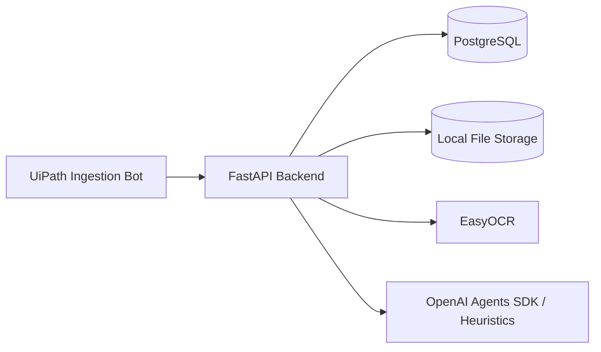
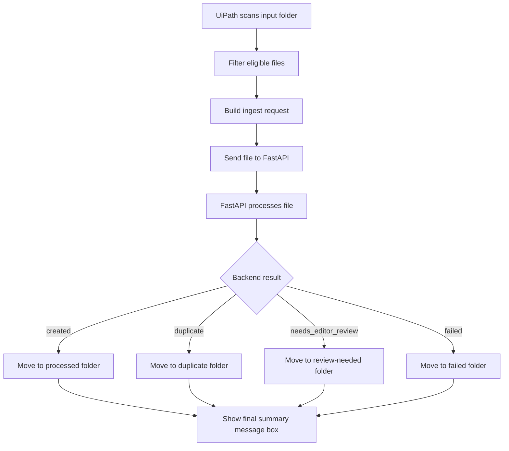

# Database Schema, System Workflow, and Architecture

## 1. Project Context

The DHL Knowledge Base Automation project is designed to move messy operational source files into a backend workflow that can process and structure them into draft knowledge-base content.

The current documented scope covers the implemented UiPath ingestion flow up to:

- source folder scanning
- file filtering
- request building
- sending the file to FastAPI
- reading the backend result
- routing the file
- showing the final run summary in a message box

## 2. Core Objective

The objective of the current implementation is to let UiPath act as a thin ingestion layer while FastAPI owns the actual processing logic.

UiPath is responsible for:

- detecting files
- submitting files
- handling returned status
- routing files after processing

FastAPI is responsible for:

- storing uploaded files
- extracting text
- duplicate detection
- OCR when needed
- AI or heuristic draft generation
- article creation
- returning the final processing result

## 3. Technology Stack

| Layer | Technology |
| --- | --- |
| Frontend | React + Vite + Tailwind CSS |
| Backend | FastAPI |
| Database | PostgreSQL |
| File storage | Local filesystem |
| RPA | UiPath Studio |
| OCR | EasyOCR |
| LLM | OpenAI Agents SDK |

## 4. High-Level Architecture

## 5. UiPath Scope

### 5.1 Implemented Workflow Files

The completed UiPath workflow includes:

- `Main.xaml`
- `Init_Config.xaml`
- `Scan_Source_Folder.xaml`
- `Filter_Eligible_Files.xaml`
- `Build_Ingest_Request.xaml`
- `Send_To_FastAPI.xaml`
- `Handle_Backend_Result.xaml`
- `Route_File.xaml`

### 5.2 UiPath Responsibilities

UiPath should:

1. load configuration
2. scan the input folder
3. filter eligible file types
4. loop through the detected files
5. build the ingest request
6. send the file to the backend
7. parse the backend result
8. move the file to the correct folder
9. show the final result in a message box

### 5.3 UiPath Boundary

UiPath should not:

- write directly to the database
- perform OCR itself
- call OpenAI directly
- generate final article content
- publish articles

## 6. Backend Processing Scope

The backend receives the file from UiPath and handles the processing pipeline.

Main backend responsibilities:

1. accept the incoming source file
2. store the file
3. extract text
4. check for duplicates
5. run OCR for image-based sources when needed
6. generate draft article content
7. save the article and related records
8. return the processing result

## 7. Main Workflow

## 8. Result Types

The UiPath workflow handles these final backend statuses:

| Status | Meaning | UiPath action |
| --- | --- | --- |
| `created` | Article was created successfully | Move file to `processed/` |
| `duplicate` | Duplicate source was detected | Move file to `duplicate/` |
| `needs_editor_review` | Backend processed the file but flagged it for review | Move file to `review-needed/` |
| `failed` | Backend could not complete processing | Move file to `failed/` |

## 9. Folder Design

Recommended working folders:

- `input/`
- `processed/`
- `duplicate/`
- `review-needed/`
- `failed/`

Folder usage:

- `input/` stores newly detected files
- `processed/` stores successfully created items
- `duplicate/` stores duplicate items
- `review-needed/` stores items flagged for editor review
- `failed/` stores files whose processing failed

## 10. Run Summary Output

At the end of the run, UiPath shows a message box with the final summary.

Suggested summary fields:

- total detected files
- created count
- duplicate count
- needs review count
- failed count

This message box is the final output of the current implemented automation flow.

## 11. Key Design Rules

1. UiPath remains a thin ingestion bot.
2. FastAPI owns all business logic and persistence.
3. UiPath only handles scanning, submission, result handling, and file routing.
4. The workflow ends with a final message box summary.
5. The current documented implementation stops at `Step 12: Build Route_File.xaml`.
